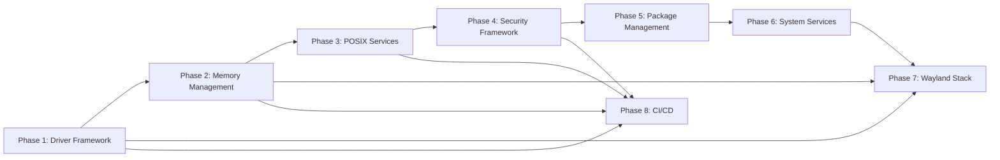

# Design Document: Turnix Production Readiness

## Overview

This document describes the technical design for bringing Turnix OS from its current Phase 6 state (28/400 production-readiness score) to desktop production-readiness (320+/400). The design covers eight interdependent phases: kernel driver framework, memory management maturity, POSIX system services, security framework, package management, system services layer, Wayland graphical stack, and CI/CD validation.

Turnix is a Rust-first x86_64 monolithic kernel. The design preserves the existing higher-half kernel layout (`0xFFFF_8000_0000_0000` HHDM, `0xFFFF_FFFF_8000_0000` kernel code), the UEFI boot chain, the LAPIC/IOAPIC interrupt model, and the preemptive round-robin scheduler. Every new subsystem is designed as a Rust crate with explicit trait boundaries, minimal `unsafe`, and no kernel-global mutable statics.

### Key Technology Choices

| Concern | Choice | Rationale |
|---|---|---|
| Network stack | `smoltcp` 0.11 | Pure Rust, no_std, MIT/Apache-2.0, proven in embedded and OS projects |
| ACPI | `acpi` + `aml` crates | Pure Rust, no_std, actively maintained |
| Wayland protocol | `wayland-server` (smithay) | Pure Rust Wayland compositor toolkit |
| TUF client | `tough` (AWS) | Production-grade TUF client, Apache-2.0 |
| SAT solver | `varisat` | Pure Rust CDCL SAT solver, MIT/Apache-2.0 |
| Property-based testing | `proptest` | Mature Rust PBT library, MIT/Apache-2.0 |
| Filesystem | `ext4` crate + custom ext2 | Read-only ext2 exists; ext4 read-write via `ext4` crate |
| BPF | Custom minimal BPF interpreter | Seccomp-BPF requires only a subset of classic BPF |


## Architecture

### High-Level System Diagram

```mermaid
graph TB
    subgraph "User Space (Ring 3)"
        APPS[Applications]
        SHELL[Desktop Shell]
        COMP[Wayland Compositor]
        DM[Display Manager]
        SVCMGR[Service Manager]
        IPCB[IPC Broker]
        NETMGR[Network Manager]
        DEVMGR[Device Manager]
        LOGD[Log Daemon]
        PKGMGR[Package Manager]
        INIT[Init Daemon PID 1]
    end
    
    subgraph "Kernel Space (Ring 0)"
        subgraph "System Call Interface"
            SYSCALL[SYSCALL/SYSRET Handler]
        end
        
        subgraph "Security Framework"
            CAP[Capabilities]
            NS[Namespaces]
            SECCOMP[Seccomp-BPF]
            LSM[LSM Hooks]
            IMA[IMA/EVM]
        end
        
        subgraph "Process Management"
            SCHED[Scheduler]
            PROC[Process Table]
            SIG[Signal Dispatcher]
        end
        
        subgraph "Memory Management"
            VMM[VMA Manager]
            PAGING[Demand Paging]
            PCACHE[Page Cache]
            SWAP[Swap Manager]
            OOM[OOM Killer]
            ASLR[ASLR/KASLR]
        end
        
        subgraph "VFS Layer"
            VFS[VFS Core]
            MOUNT[Mount Manager]
            EXT2[ext2 Backend]
            EXT4[ext4 Backend]
            TMPFS[tmpfs Backend]
        end
        
        subgraph "Network Stack"
            SMOL[smoltcp TCP/IP]
            SOCK[Socket Layer]
        end
        
        subgraph "Driver Framework"
            DRVREG[Device Registry]
            PCIE[PCIe Enumerator]
            XHCI[XHCI Driver]
            NVME[NVMe Driver]
            VNET[VirtIO-Net]
            GPU[GPU Framebuffer]
            WIFI[Wi-Fi HAL]
        end
        
        subgraph "Platform"
            ACPI[ACPI Interpreter]
            LAPIC[LAPIC/IOAPIC]
            GDT[GDT/IDT]
            ARCH[Arch Abstraction]
        end
    end
    
    subgraph "Hardware"
        CPU[CPU]
        RAM[RAM]
        DISK[NVMe/AHCI]
        NIC[Network Card]
        USB[USB Devices]
        DISPLAY[Display]
    end
    
    APPS --> COMP
    SHELL --> COMP
    COMP --> SYSCALL
    DM --> SYSCALL
    SVCMGR --> SYSCALL
    IPCB --> SYSCALL
    NETMGR --> SYSCALL
    DEVMGR --> SYSCALL
    LOGD --> SYSCALL
    PKGMGR --> SYSCALL
    INIT --> SYSCALL
    
    SYSCALL --> CAP
    SYSCALL --> NS
    SYSCALL --> SECCOMP
    SYSCALL --> LSM
    
    CAP --> PROC
    NS --> PROC
    SECCOMP --> PROC
    LSM --> VFS
    LSM --> PROC
    
    PROC --> SCHED
    PROC --> SIG
    PROC --> VMM
    
    VMM --> PAGING
    VMM --> PCACHE
    VMM --> SWAP
    VMM --> OOM
    VMM --> ASLR
    
    VFS --> MOUNT
    MOUNT --> EXT2
    MOUNT --> EXT4
    MOUNT --> TMPFS
    
    SOCK --> SMOL
    SMOL --> VNET
    
    DRVREG --> PCIE
    DRVREG --> XHCI
    DRVREG --> NVME
    DRVREG --> VNET
    DRVREG --> GPU
    DRVREG --> WIFI
    
    PCIE --> ACPI
    LAPIC --> ACPI
    
    XHCI --> USB
    NVME --> DISK
    VNET --> NIC
    GPU --> DISPLAY
    WIFI --> NIC
```



### Dependency Graph Between Phases



**Critical Path**: Phase 1 (drivers) → Phase 2 (memory) → Phase 3 (POSIX) → Phase 4 (security) → Phase 5 (packages) → Phase 6 (services) → Phase 7 (Wayland) → Phase 8 (CI)

**Parallelizable Work**:
- Phase 1 driver stubs can be written while Phase 2 memory work is in progress
- Phase 4 security hooks can be added while Phase 3 POSIX primitives are being tested
- Phase 7 Wayland compositor can start once Phase 1 GPU driver and Phase 2 memory mapping are stable


## Components and Interfaces

### Workspace Crate Structure

The existing workspace will be extended with the following new crates:

```
turnix/
├── kernel/                          # Existing kernel crate (extended)
│   └── src/
│       ├── arch/                    # NEW: arch abstraction boundary
│       │   ├── mod.rs               # ArchInterface trait
│       │   ├── x86_64/              # x86_64 implementations
│       │   └── aarch64/             # AArch64 stubs
│       ├── drivers/                 # Extended
│       │   ├── framework.rs         # NEW: DeviceDriver trait + Device_Registry
│       │   ├── pcie.rs              # NEW: PCIe ECAM enumerator
│       │   ├── xhci.rs              # NEW: XHCI USB driver
│       │   ├── nvme.rs              # NEW: NVMe driver
│       │   ├── virtio_net.rs        # NEW: VirtIO-Net driver
│       │   ├── gpu/                 # NEW: GPU framebuffer + DRM/KMS
│       │   └── wifi/                # NEW: Wi-Fi HAL
│       ├── memory/                  # Extended
│       │   ├── vma.rs               # NEW: VMA tracker
│       │   ├── demand.rs            # NEW: demand paging fault handler
│       │   ├── page_cache.rs        # NEW: page cache
│       │   ├── swap.rs              # NEW: swap manager
│       │   ├── oom.rs               # NEW: OOM killer
│       │   └── aslr.rs              # NEW: ASLR/KASLR
│       ├── fs/                      # Extended
│       │   ├── vfs.rs               # NEW: real VFS with mount table
│       │   ├── ext2.rs              # Extended: read-only ext2
│       │   ├── ext4.rs              # NEW: read-write ext4
│       │   └── tmpfs.rs             # NEW: tmpfs backend
│       ├── net/                     # NEW: network subsystem
│       │   ├── socket.rs            # Socket layer
│       │   ├── smoltcp_iface.rs     # smoltcp integration
│       │   └── wifi_hal.rs          # Wi-Fi HAL
│       ├── security/                # Extended
│       │   ├── capabilities.rs      # NEW: full POSIX 64-bit capabilities
│       │   ├── namespaces.rs        # NEW: PID/mount/net/user namespaces
│       │   ├── seccomp.rs           # NEW: seccomp-BPF
│       │   ├── lsm.rs               # NEW: LSM hook framework
│       │   └── ima.rs               # NEW: IMA/EVM
│       ├── ipc/                     # NEW: kernel IPC primitives
│       │   ├── pipe.rs              # Pipe implementation
│       │   └── unix_socket.rs       # Unix domain sockets
│       └── acpi/                    # Extended: full AML evaluation
├── userland/
│   ├── init/                        # Extended: full PID-1 init
│   ├── service-manager/             # NEW: Rust-native service manager
│   ├── ipc-broker/                  # NEW: async IPC broker
│   ├── log-daemon/                  # NEW: structured log daemon
│   ├── network-manager/             # NEW: network manager
│   ├── device-manager/              # NEW: device manager
│   ├── compositor/                  # NEW: Wayland compositor (smithay)
│   ├── display-manager/             # NEW: greetd-style display manager
│   ├── desktop-shell/               # NEW: minimal desktop shell
│   ├── package-manager/             # NEW: tpkg package manager
│   └── libturnix/                   # Extended: full standard library
└── shared/
    ├── abi/                         # Extended: full syscall ABI
    ├── tpkg-format/                 # NEW: .tpkg manifest types
    └── ipc-proto/                   # NEW: IPC protocol types
```

### Phase 1: Driver Framework — Key Traits

```rust
// kernel/src/drivers/framework.rs

/// Typestate markers for driver lifecycle
pub struct Unprobed;
pub struct Probed;
pub struct Initialised;
pub struct Suspended;

/// Core driver trait — all hardware drivers implement this
pub trait DeviceDriver: Send + Sync {
    type Config;
    type Error: core::fmt::Debug;

    /// Probe: check if this driver handles the given device
    fn probe(device: &DeviceInfo) -> Result<Self, Self::Error>
    where
        Self: Sized;

    /// Initialize: set up hardware, allocate resources
    fn initialize(&mut self) -> Result<(), Self::Error>;

    /// Suspend: save state, power down
    fn suspend(&mut self) -> Result<(), Self::Error>;

    /// Resume: restore state, power up
    fn resume(&mut self) -> Result<(), Self::Error>;

    /// Human-readable driver name for logging
    fn name(&self) -> &'static str;
}

/// Device information from PCIe enumeration
#[derive(Debug, Clone)]
pub struct DeviceInfo {
    pub vendor_id: u16,
    pub device_id: u16,
    pub class_code: u8,
    pub subclass: u8,
    pub prog_if: u8,
    pub bars: [Option<Bar>; 6],
    pub irq: Option<u8>,
}

#[derive(Debug, Clone)]
pub enum Bar {
    Memory32 { base: u32, size: u32, prefetchable: bool },
    Memory64 { base: u64, size: u64, prefetchable: bool },
    Io { port: u16, size: u16 },
}

/// Global device registry — maps device keys to boxed driver instances
pub struct DeviceRegistry {
    devices: BTreeMap<DeviceKey, Arc<dyn AnyDriver>>,
}

impl DeviceRegistry {
    pub fn register<D: DeviceDriver + 'static>(&mut self, key: DeviceKey, driver: D);
    pub fn get<D: DeviceDriver + 'static>(&self, key: &DeviceKey) -> Option<&D>;
    pub fn iter(&self) -> impl Iterator<Item = (&DeviceKey, &dyn AnyDriver)>;
}
```

### Phase 2: Memory Management — Key Structures

```rust
// kernel/src/memory/vma.rs

#[derive(Debug, Clone, Copy, PartialEq, Eq)]
pub struct VmaProt: u8 {
    const READ    = 0b001;
    const WRITE   = 0b010;
    const EXECUTE = 0b100;
}

#[derive(Debug, Clone)]
pub enum VmaBacking {
    Anonymous,
    FileBacked { inode: InodeId, offset: u64 },
    DeviceMapped { device: DeviceKey },
}

#[derive(Debug, Clone)]
pub struct Vma {
    pub start: VirtAddr,
    pub end: VirtAddr,
    pub prot: VmaProt,
    pub backing: VmaBacking,
    pub flags: VmaFlags,  // MAP_SHARED, MAP_PRIVATE, MAP_FIXED, etc.
}

pub struct VmaSet {
    // Interval tree for O(log n) lookup by address
    tree: IntervalTree<VirtAddr, Vma>,
}

impl VmaSet {
    pub fn find(&self, addr: VirtAddr) -> Option<&Vma>;
    pub fn insert(&mut self, vma: Vma) -> Result<(), VmaError>;
    pub fn remove(&mut self, start: VirtAddr) -> Option<Vma>;
    pub fn iter(&self) -> impl Iterator<Item = &Vma>;
}

// kernel/src/memory/page_cache.rs

pub struct PageCache {
    // (inode_id, page_index) -> CachedPage
    pages: BTreeMap<(InodeId, u64), CachedPage>,
    lru: VecDeque<(InodeId, u64)>,
    total_pages: usize,
    dirty_pages: usize,
}

#[derive(Debug)]
pub struct CachedPage {
    pub frame: PhysFrame,
    pub dirty: bool,
    pub ref_count: usize,
    pub last_access: Instant,
}

impl PageCache {
    pub fn lookup(&mut self, inode: InodeId, page_idx: u64) -> Option<PhysFrame>;
    pub fn insert(&mut self, inode: InodeId, page_idx: u64, frame: PhysFrame);
    pub fn mark_dirty(&mut self, inode: InodeId, page_idx: u64);
    pub fn evict_lru(&mut self, count: usize) -> Vec<(InodeId, u64)>;
}
```

### Phase 3: VFS — Key Traits

```rust
// kernel/src/fs/vfs.rs

/// The core VFS backend trait — all filesystem implementations implement this
pub trait FsBackend: Send + Sync {
    fn root_inode(&self) -> InodeId;
    fn lookup(&self, parent: InodeId, name: &str) -> Result<InodeId, FsError>;
    fn open(&self, inode: InodeId, flags: OpenFlags) -> Result<FileHandle, FsError>;
    fn read(&self, handle: &FileHandle, buf: &mut [u8], offset: u64) -> Result<usize, FsError>;
    fn write(&self, handle: &FileHandle, buf: &[u8], offset: u64) -> Result<usize, FsError>;
    fn stat(&self, inode: InodeId) -> Result<InodeStat, FsError>;
    fn readdir(&self, inode: InodeId) -> Result<Vec<DirEntry>, FsError>;
    fn mkdir(&self, parent: InodeId, name: &str, mode: u32) -> Result<InodeId, FsError>;
    fn unlink(&self, parent: InodeId, name: &str) -> Result<(), FsError>;
    fn rename(&self, old_parent: InodeId, old_name: &str,
              new_parent: InodeId, new_name: &str) -> Result<(), FsError>;
    fn sync(&self) -> Result<(), FsError>;
}

/// Mount table entry
pub struct MountEntry {
    pub mount_point: PathBuf,
    pub backend: Arc<dyn FsBackend>,
    pub flags: MountFlags,
}

/// VFS core — path resolution with mount point traversal
pub struct Vfs {
    mounts: Vec<MountEntry>,  // sorted by mount_point length descending
}

impl Vfs {
    pub fn mount(&mut self, point: &Path, backend: Arc<dyn FsBackend>, flags: MountFlags)
        -> Result<(), VfsError>;
    pub fn umount(&mut self, point: &Path) -> Result<(), VfsError>;
    pub fn resolve(&self, path: &Path) -> Result<(Arc<dyn FsBackend>, InodeId), VfsError>;
    pub fn open(&self, path: &Path, flags: OpenFlags) -> Result<FileDescriptor, VfsError>;
}
```

### Phase 4: Security — Key Structures

```rust
// kernel/src/security/capabilities.rs

/// Full POSIX 64-bit capability set per process
#[derive(Debug, Clone, Copy, Default)]
pub struct CapabilitySet {
    pub effective:    u64,
    pub permitted:    u64,
    pub inheritable:  u64,
    pub bounding:     u64,
    pub ambient:      u64,
}

impl CapabilitySet {
    /// Apply POSIX exec transformation rules
    pub fn exec_transform(&self, file_caps: &FileCaps) -> CapabilitySet {
        let new_permitted = (self.inheritable & file_caps.inheritable)
            | (file_caps.permitted & self.bounding);
        let new_effective = if file_caps.effective_bit {
            new_permitted
        } else {
            0
        };
        CapabilitySet {
            permitted: new_permitted,
            effective: new_effective,
            inheritable: self.inheritable,
            bounding: self.bounding,
            ambient: self.ambient & new_permitted,
        }
    }

    pub fn has(&self, cap: Capability) -> bool {
        self.effective & (1u64 << cap as u8) != 0
    }
}

// kernel/src/security/lsm.rs

/// LSM hook trait — security modules implement this
pub trait LsmHook: Send + Sync {
    fn file_open(&self, cred: &Credentials, inode: InodeId, flags: OpenFlags)
        -> Result<(), LsmError>;
    fn process_create(&self, parent: &Credentials, child: &Credentials)
        -> Result<(), LsmError>;
    fn ipc_send(&self, sender: &Credentials, receiver: &Credentials)
        -> Result<(), LsmError>;
    fn net_connect(&self, cred: &Credentials, addr: &SocketAddr)
        -> Result<(), LsmError>;
    fn capability_check(&self, cred: &Credentials, cap: Capability)
        -> Result<(), LsmError>;
}

// kernel/src/security/seccomp.rs

/// Classic BPF program for seccomp filtering
pub struct SeccompFilter {
    instructions: Vec<BpfInstruction>,
}

impl SeccompFilter {
    pub fn evaluate(&self, syscall_nr: u32, args: &[u64; 6]) -> SeccompAction;
    pub fn inherit_on_fork(&self) -> SeccompFilter { self.clone() }
}

#[derive(Debug, Clone, Copy)]
pub enum SeccompAction {
    Allow,
    KillProcess,
    Errno(i32),
    Trace,
}
```

### Phase 5: Package Manager — Key Structures

```rust
// shared/tpkg-format/src/lib.rs

/// turnix.toml manifest — strict TOML subset
#[derive(Debug, Clone, PartialEq, serde::Serialize, serde::Deserialize)]
pub struct TpkgManifest {
    pub name: PackageName,
    pub version: semver::Version,
    pub description: String,
    pub dependencies: BTreeMap<PackageName, VersionReq>,
    pub install: InstallSpec,
    pub build: Option<BuildSpec>,
    pub scripts: Option<Scripts>,
}

#[derive(Debug, Clone, PartialEq, serde::Serialize, serde::Deserialize)]
pub struct InstallSpec {
    /// Path to the ELF binary or library within the archive
    pub binary: Option<PathBuf>,
    /// Install destination (e.g., /usr/bin/foo)
    pub dest: PathBuf,
    /// Additional data files to install
    pub data: Vec<DataFile>,
}

#[derive(Debug, Clone, PartialEq, serde::Serialize, serde::Deserialize)]
pub struct BuildSpec {
    /// Arbitrary build command (make, cmake, cargo, etc.)
    pub command: String,
    pub env: BTreeMap<String, String>,
    pub output: PathBuf,
}

// userland/package-manager/src/solver.rs

/// SAT-based dependency solver using varisat
pub struct DependencySolver {
    packages: BTreeMap<PackageName, Vec<PackageVersion>>,
}

impl DependencySolver {
    pub fn solve(&self, requests: &[(PackageName, VersionReq)])
        -> Result<InstallPlan, SolverError>;
}

#[derive(Debug)]
pub enum SolverError {
    Conflict { package: PackageName, requirements: Vec<VersionReq> },
    Cycle { packages: Vec<PackageName> },
    NotFound { package: PackageName },
}
```

### Phase 6: Service Manager — Key Structures

```rust
// userland/service-manager/src/unit.rs

#[derive(Debug, Clone, serde::Deserialize)]
pub struct ServiceUnit {
    pub name: String,
    pub description: String,
    pub after: Vec<String>,
    pub requires: Vec<String>,
    pub exec_start: String,
    pub restart: RestartPolicy,
    pub restart_delay_secs: u64,
    pub timeout_start_secs: u64,
    pub socket_activation: Option<SocketSpec>,
}

#[derive(Debug, Clone, Copy, serde::Deserialize)]
pub enum RestartPolicy {
    Never,
    OnFailure,
    Always,
}

// userland/ipc-broker/src/lib.rs

/// IPC message types
#[derive(Debug, Clone, serde::Serialize, serde::Deserialize)]
pub enum IpcMessage {
    MethodCall { destination: String, method: String, args: Vec<IpcValue> },
    MethodReturn { reply_serial: u32, result: Result<Vec<IpcValue>, IpcError> },
    Signal { interface: String, name: String, args: Vec<IpcValue> },
    PropertyGet { interface: String, property: String },
    PropertySet { interface: String, property: String, value: IpcValue },
}
```

### Phase 7: Wayland Compositor — Key Structures

```rust
// userland/compositor/src/lib.rs

/// Compositor state — built on smithay
pub struct TurnixCompositor {
    display: wayland_server::Display<Self>,
    backend: DrmBackend,
    input_manager: InputManager,
    surfaces: BTreeMap<SurfaceId, Surface>,
    focused: Option<SurfaceId>,
}

pub struct Surface {
    pub id: SurfaceId,
    pub buffer: Option<GbmBuffer>,
    pub geometry: Rectangle,
    pub title: String,
    pub pid: u32,
}

// kernel/src/drivers/gpu/drm.rs

pub trait DrmDevice: Send + Sync {
    fn enumerate_connectors(&self) -> Vec<Connector>;
    fn set_mode(&self, connector: ConnectorId, mode: &DisplayMode,
                crtc: CrtcId, fb: FramebufferId) -> Result<(), DrmError>;
    fn page_flip(&self, crtc: CrtcId, fb: FramebufferId) -> Result<(), DrmError>;
    fn create_framebuffer(&self, width: u32, height: u32, format: PixelFormat)
        -> Result<FramebufferId, DrmError>;
}
```


## Data Models

### Process Control Block (Extended)

```rust
// kernel/src/process.rs (extended)

pub struct ProcessControlBlock {
    pub pid: ProcessId,
    pub ppid: ProcessId,
    pub state: ProcessState,
    
    // Address space
    pub pml4_frame: PhysFrame,
    pub vma_set: VmaSet,
    pub aslr_base: VirtAddr,
    
    // File descriptors (1024 limit)
    pub fd_table: FdTable,  // [Option<FileDescriptor>; 1024]
    
    // Security
    pub credentials: Credentials,
    pub capabilities: CapabilitySet,
    pub seccomp_filter: Option<Arc<SeccompFilter>>,
    pub namespaces: NamespaceSet,
    
    // Signals
    pub signal_mask: SignalSet,
    pub signal_handlers: [SignalAction; 64],
    pub pending_signals: SignalSet,
    
    // Namespace membership
    pub pid_ns: Arc<PidNamespace>,
    pub mnt_ns: Arc<MountNamespace>,
    pub net_ns: Arc<NetNamespace>,
    pub user_ns: Arc<UserNamespace>,
}

#[derive(Debug, Clone, Copy, PartialEq, Eq)]
pub enum ProcessState {
    Running,
    Ready,
    Blocked(BlockReason),
    Zombie { exit_code: i32 },
    Stopped,
}

#[derive(Debug, Clone, Copy, PartialEq, Eq)]
pub enum BlockReason {
    WaitingForChild,
    WaitingForIo,
    WaitingForLock,
    Sleeping { until: Instant },
}
```

### Inode and File Descriptor

```rust
// kernel/src/fs/vfs.rs

#[derive(Debug, Clone, Copy, PartialEq, Eq, PartialOrd, Ord)]
pub struct InodeId(pub u64);

#[derive(Debug, Clone)]
pub struct InodeStat {
    pub inode: InodeId,
    pub size: u64,
    pub file_type: FileType,
    pub mode: u32,       // Unix permission bits
    pub uid: u32,
    pub gid: u32,
    pub nlink: u32,
    pub atime: Timestamp,
    pub mtime: Timestamp,
    pub ctime: Timestamp,
}

#[derive(Debug)]
pub struct FileDescriptor {
    pub inode: InodeId,
    pub backend: Arc<dyn FsBackend>,
    pub offset: AtomicU64,
    pub flags: OpenFlags,
    pub kind: FdKind,
}

#[derive(Debug)]
pub enum FdKind {
    Regular,
    Directory,
    Pipe(Arc<PipeBuffer>),
    UnixSocket(Arc<UnixSocketState>),
    Device(DeviceKey),
    Epoll,
}
```

### Package Manifest and Install Plan

```rust
// shared/tpkg-format/src/lib.rs

#[derive(Debug, Clone, PartialEq)]
pub struct InstallPlan {
    /// Ordered list of packages to install (topological order)
    pub packages: Vec<ResolvedPackage>,
    /// Total download size in bytes
    pub download_size: u64,
    /// Total installed size in bytes
    pub install_size: u64,
}

#[derive(Debug, Clone, PartialEq)]
pub struct ResolvedPackage {
    pub name: PackageName,
    pub version: semver::Version,
    pub source: PackageSource,
    pub checksum: [u8; 32],  // SHA-256
}

#[derive(Debug, Clone, PartialEq)]
pub enum PackageSource {
    Repository { url: String },
    Local { path: PathBuf },
    BuildFromSource { manifest: TpkgManifest },
}
```

### Snapshot Record

```rust
// userland/package-manager/src/snapshot.rs

#[derive(Debug, Clone, serde::Serialize, serde::Deserialize)]
pub struct Snapshot {
    pub id: SnapshotId,
    pub created_at: Timestamp,
    pub trigger: SnapshotTrigger,
    pub ext4_snapshot_inode: u64,
    pub affected_paths: Vec<PathBuf>,
}

#[derive(Debug, Clone, serde::Serialize, serde::Deserialize)]
pub enum SnapshotTrigger {
    PreInstall { package: PackageName, version: semver::Version },
    PreUpgrade { package: PackageName, from: semver::Version, to: semver::Version },
    Manual,
}
```


## Correctness Properties

*A property is a characteristic or behavior that should hold true across all valid executions of a system — essentially, a formal statement about what the system should do. Properties serve as the bridge between human-readable specifications and machine-verifiable correctness guarantees.*

This feature involves substantial pure-logic code (dependency solver, manifest parser, VMA tracker, page cache, capability transformer, seccomp evaluator, signal dispatcher, pipe buffer) that is well-suited to property-based testing. Infrastructure-heavy subsystems (ACPI, DRM/KMS, XHCI, NVMe, Wayland) are covered by integration tests instead.

---

### Property 1: Device Registry Round-Trip

*For any* set of device drivers where some succeed probe and some fail, the Device_Registry SHALL contain exactly the drivers that returned `Ok` from `probe`, and looking up any registered driver by its device key SHALL return the same driver instance.

**Validates: Requirements 1.2, 1.4**

---

### Property 2: Driver Lifecycle Invariant

*For any* driver implementing `DeviceDriver`, calling `initialize` after a successful `probe` SHALL succeed, and calling `suspend` followed by `resume` SHALL restore the driver to its pre-suspend observable state (same device info, same configuration).

**Validates: Requirements 1.1, 1.6**

---

### Property 3: Demand Paging Zero-Fill

*For any* anonymous VMA created via `mmap(MAP_ANONYMOUS)`, reading any byte within the mapped region before writing to it SHALL return zero.

**Validates: Requirements 9.2, 9.3**

---

### Property 4: VMA Tracking Consistency

*For any* sequence of `mmap` and `munmap` calls with valid parameters, the VMA set SHALL accurately reflect the current state: every mapped address SHALL be covered by exactly one VMA with the correct protection flags, and every unmapped address SHALL not be covered by any VMA.

**Validates: Requirements 9.1, 9.4**

---

### Property 5: SIGSEGV on Unmapped Access

*For any* virtual address that is not covered by any VMA in the current process, a memory access to that address SHALL deliver `SIGSEGV` to the faulting process and SHALL NOT cause a kernel panic.

**Validates: Requirements 9.5**

---

### Property 6: Page Cache Read Idempotence

*For any* file and any page index within that file, reading the same page twice SHALL result in exactly one block I/O request being issued to the underlying storage device, with the second read served entirely from the cache.

**Validates: Requirements 10.1, 10.2**

---

### Property 7: Page Cache LRU Eviction Order

*For any* sequence of page accesses under memory pressure, the page evicted SHALL be the one with the earliest last-access timestamp among all evictable pages (i.e., the least recently used page).

**Validates: Requirements 10.3**

---

### Property 8: Page Cache Sharing

*For any* file mapped by N processes (N ≥ 2), the number of distinct physical frames backing that file's pages SHALL equal the number of unique pages in the file, not N times that number.

**Validates: Requirements 10.5**

---

### Property 9: ASLR Address Diversity

*For any* 10 consecutive `exec` calls of the same binary, all 10 resulting load base addresses SHALL be distinct.

**Validates: Requirements 13.1**

---

### Property 10: ASLR Fork Address Diversity

*For any* process, the stack and heap base addresses of a forked child SHALL differ from those of the parent.

**Validates: Requirements 13.3**

---

### Property 11: ELF Segment Relative Layout Preservation

*For any* PIE ELF binary with N segments, the difference between the virtual addresses of any two segments in the loaded process SHALL equal the difference between those segments' virtual addresses in the ELF file, regardless of the ASLR base address chosen.

**Validates: Requirements 13.4**

---

### Property 12: W^X Invariant

*For any* page in any address space (user or kernel), no page table entry SHALL have both the `WRITABLE` flag set and the `NO_EXECUTE` flag clear simultaneously.

**Validates: Requirements 14.1, 14.3**

---

### Property 13: mmap W+X Rejection

*For any* `mmap` call that requests both `PROT_WRITE` and `PROT_EXEC`, the call SHALL return `EACCES` and SHALL NOT create any mapping.

**Validates: Requirements 14.2**

---

### Property 14: Fork Address Space Consistency

*For any* process with a set of mapped VMAs, a forked child SHALL have identical content at every mapped address as the parent at the moment of fork (copy-on-write semantics: reads return the same values, writes to the child do not affect the parent).

**Validates: Requirements 17.1**

---

### Property 15: Wait Exit Status Round-Trip

*For any* exit code `c` in the range [0, 255], a child process that calls `exit(c)` SHALL cause a subsequent `wait` by the parent to return exactly `c` as the exit status, and the child SHALL be in `Zombie` state between `exit` and `wait`.

**Validates: Requirements 17.3, 17.4**

---

### Property 16: Pipe Data Integrity

*For any* byte sequence written to the write end of a pipe, reading from the read end SHALL produce the same byte sequence in the same order, with no bytes lost or reordered.

**Validates: Requirements 18.1**

---

### Property 17: Pipe Blocking on Full Buffer

*For any* pipe whose buffer is at capacity, a write attempt SHALL block the writing thread until at least one byte of space becomes available, at which point the write SHALL proceed.

**Validates: Requirements 18.3**

---

### Property 18: Signal Handler Delivery

*For any* signal number `s` and handler function `h` registered via `sigaction`, delivering signal `s` to the process SHALL invoke `h` with the correct signal number, and after `sigreturn` the process SHALL resume execution at the instruction following the interrupted point with the original register state restored.

**Validates: Requirements 19.2, 19.4, 19.5**

---

### Property 19: Signal Mask Blocking

*For any* signal mask set via `sigprocmask`, signals in the mask SHALL NOT be delivered to the process while the mask is active, and SHALL be delivered (if pending) when the mask is cleared.

**Validates: Requirements 19.6**

---

### Property 20: VFS Path Lookup Across Mount Points

*For any* path that crosses a mount point boundary, the VFS SHALL transparently resolve the path by delegating to the mounted filesystem backend, returning the same result as if the path were resolved entirely within a single filesystem.

**Validates: Requirements 21.5**

---

### Property 21: POSIX Capability Exec Transformation

*For any* process capability set and file capability set, the capability sets after `exec` SHALL be computed exactly according to the POSIX transformation rules:
- `new_permitted = (inheritable & file_inheritable) | (file_permitted & bounding)`
- `new_effective = new_permitted` if `file_effective_bit` is set, else `0`
- `new_inheritable = inheritable`

**Validates: Requirements 22.3**

---

### Property 22: Capability Drop Irreversibility

*For any* capability `c` dropped from a process's permitted set, the process SHALL NOT be able to re-acquire `c` in its effective set without executing a new file that has `c` in its file permitted set.

**Validates: Requirements 22.4**

---

### Property 23: Seccomp Filter Inheritance

*For any* process with a seccomp filter installed, every child process created via `fork` SHALL have the same seccomp filter applied, and the child SHALL NOT be able to install a less restrictive filter.

**Validates: Requirements 24.5, 24.6**

---

### Property 24: Manifest Parse-Serialize Round-Trip

*For any* valid `turnix.toml` manifest, parsing it into a `TpkgManifest` struct, serializing it back to TOML, and parsing the result again SHALL produce a `TpkgManifest` that is structurally equivalent to the original.

**Validates: Requirements 28.3**

---

### Property 25: Invalid Manifest Rejection

*For any* string that does not conform to the `turnix.toml` grammar (missing required fields, wrong types, invalid version strings), parsing SHALL return an `Err` containing a non-empty descriptive error message.

**Validates: Requirements 28.2**

---

### Property 26: Dependency Solver Correctness

*For any* satisfiable set of package version constraints, the dependency solver SHALL produce an install plan where every package in the plan satisfies all version constraints imposed on it by other packages in the plan.

**Validates: Requirements 30.1**

---

### Property 27: Dependency Solver Conflict Detection

*For any* set of package constraints that is unsatisfiable (two packages require incompatible versions of a shared dependency), the solver SHALL return a `SolverError::Conflict` identifying the conflicting requirements.

**Validates: Requirements 30.2**

---

### Property 28: Dependency Solver Newest Version Preference

*For any* dependency with multiple versions satisfying the constraints, the solver SHALL select the highest (newest) compatible version.

**Validates: Requirements 30.4**

---

### Property 29: Dependency Solver Cycle Detection

*For any* dependency graph containing a directed cycle, the solver SHALL return a `SolverError::Cycle` identifying the packages involved in the cycle.

**Validates: Requirements 30.5**

---

### Property 30: Input Event Normalization

*For any* raw kernel input event (key press, pointer motion, button click), the Input_Manager SHALL produce a normalized event of the correct type with the correct field values (key code, delta, button state), and the normalized event SHALL contain no fields from a different event type.

**Validates: Requirements 40.1**


## Error Handling

### Kernel Error Strategy

All kernel subsystems use typed `Result<T, E>` returns. Panics are reserved for unrecoverable invariant violations (e.g., corrupted page tables, stack canary failure). Every error path logs the error with the subsystem name, device identifier (where applicable), and a human-readable message via the serial logger.

```rust
// Kernel error hierarchy
#[derive(Debug)]
pub enum KernelError {
    Driver(DriverError),
    Memory(MemoryError),
    Fs(FsError),
    Security(SecurityError),
    Ipc(IpcError),
    Syscall(SyscallError),
}

#[derive(Debug)]
pub enum DriverError {
    ProbeFailure { device: DeviceKey, reason: &'static str },
    InitTimeout { device: DeviceKey, elapsed_ms: u64 },
    IoError { device: DeviceKey, code: i32 },
    NotSupported,
}

#[derive(Debug)]
pub enum MemoryError {
    OutOfFrames,
    VmaConflict { addr: VirtAddr },
    WxViolation { addr: VirtAddr },
    SwapFull,
}

#[derive(Debug)]
pub enum FsError {
    NotFound,
    PermissionDenied,
    NotADirectory,
    IsADirectory,
    AlreadyExists,
    IoError(i32),
    BackendError(Box<dyn core::fmt::Debug>),
}
```

### Driver Probe Failure Policy

When `probe` returns an error for a device, the Driver_Framework:
1. Logs `[DRIVER] probe failed for {vendor_id:04x}:{device_id:04x} — {error:?}`
2. Marks the device as `ProbeFailure` in the registry
3. Continues probing remaining devices
4. Does NOT panic or halt boot

### OOM Policy

When the OOM killer fires:
1. Logs the OOM event with available memory, swap usage, and candidate processes
2. Selects the victim with the highest OOM score (RSS × priority weight)
3. Excludes PID 1 and kernel threads
4. Sends `SIGKILL` and waits up to 5 seconds for memory reclaim
5. If reclaim fails, selects the next victim

### Package Installation Failure Policy

When package installation fails at any step:
1. The Snapshot_Manager automatically rolls back to the pre-install snapshot
2. The Package_Manager logs the failure with the step name and error
3. Returns a typed error to the caller (no partial state left on disk)
4. The TUF signature failure path aborts before any file extraction

### Service Crash Policy

When a supervised service crashes:
1. The Service_Manager logs the crash with PID, exit code, and timestamp
2. Applies the `Restart=` policy with exponential back-off
3. If the service fails to start within `TimeoutStartSec`, marks it `Failed`
4. Notifies dependent services via the IPC_Broker

### Wayland Client Crash Policy

When a Wayland client exits unexpectedly:
1. The Compositor removes all surfaces owned by that client
2. Releases all GBM buffers associated with those surfaces
3. Redraws the display without the crashed client's surfaces
4. Does NOT crash or restart the compositor


## Testing Strategy

### Dual Testing Approach

Every subsystem uses two complementary test layers:

1. **Unit tests** — specific examples, edge cases, and error conditions. Kept in `#[cfg(test)]` modules within each crate. Run with `cargo test`.
2. **Property-based tests** — universal properties across randomly generated inputs. Use `proptest` (MIT/Apache-2.0). Each property test runs a minimum of 100 iterations. Run with `cargo test` (proptest integrates with the standard test harness).

Unit tests focus on:
- Specific examples that demonstrate correct behavior (e.g., a known ELF loads at the expected address)
- Integration points between components (e.g., VFS delegates to the correct backend)
- Edge cases and error conditions (e.g., `exec` with a non-existent path returns `ENOENT`)

Property tests focus on:
- Universal invariants (W^X, VMA consistency, capability transformation rules)
- Round-trip properties (manifest parse/serialize, pipe data integrity, fork address space)
- Metamorphic properties (ASLR diversity, page cache idempotence)

### Property-Based Testing Library

**Library**: `proptest` 1.x (MIT/Apache-2.0, `no_std`-compatible with `std` feature for test builds)

**Configuration**: Each property test is tagged with a comment referencing the design property:

```rust
// Feature: turnix-production-readiness, Property 24: Manifest Parse-Serialize Round-Trip
proptest! {
    #[test]
    fn manifest_round_trip(manifest in arb_valid_manifest()) {
        let toml_str = toml::to_string(&manifest).unwrap();
        let reparsed: TpkgManifest = toml::from_str(&toml_str).unwrap();
        prop_assert_eq!(manifest, reparsed);
    }
}
```

**Minimum iterations**: 100 per property (proptest default is 256, which is acceptable).

### Per-Subsystem Test Strategy

#### Phase 1: Driver Framework
- **Property tests**: Properties 1 (registry round-trip), 2 (lifecycle invariant)
- **Integration tests**: PCIe enumeration in QEMU (device count), NVMe read/write round-trip, VirtIO-Net loopback, XHCI enumeration, GPU pixel write/read
- **Unit tests**: `DeviceInfo` parsing, BAR address calculation, `0xFFFFFFFF` slot skip

#### Phase 2: Memory Management
- **Property tests**: Properties 3–13 (demand paging, VMA, page cache, ASLR, W^X)
- **Integration tests**: Swap eviction under memory pressure, OOM killer victim selection, KASLR boot address randomization
- **Unit tests**: VMA interval tree operations, LRU eviction order with known access sequences, ASLR entropy measurement

#### Phase 3: POSIX Services
- **Property tests**: Properties 14–20 (fork, wait, pipe, signal, VFS)
- **Integration tests**: Full fork/exec/wait cycle, Unix socket bidirectional communication, stdin/stdout/stderr inheritance, mount/umount lifecycle
- **Unit tests**: Signal mask operations, pipe EOF behavior, `dup`/`dup2` semantics

#### Phase 4: Security Framework
- **Property tests**: Properties 21–23 (capability transformation, seccomp inheritance)
- **Integration tests**: Namespace isolation (PID, mount, net, user), LSM hook enforcement, IMA measurement log, stack canary detection
- **Unit tests**: Capability bitmask operations, BPF instruction evaluation, seccomp action dispatch

#### Phase 5: Package Management
- **Property tests**: Properties 24–29 (manifest round-trip, solver correctness, conflict/cycle detection)
- **Integration tests**: TUF metadata fetch and verification, `.tpkg` install/rollback, build-from-source invocation
- **Unit tests**: TOML manifest parsing errors, snapshot creation timing, version constraint matching

#### Phase 6: System Services
- **Integration tests**: Service dependency ordering, restart policy with back-off, IPC method call round-trip, log entry HMAC sealing, network DHCP configuration, USB hotplug mount
- **Unit tests**: Service unit file parsing, IPC message serialization, log rotation trigger

#### Phase 7: Wayland Stack
- **Property tests**: Property 30 (input event normalization)
- **Integration tests**: Wayland client surface display, DRM/KMS mode set and page flip, GBM buffer allocation and mmap, display manager login flow
- **Unit tests**: Keyboard scan code to Unicode mapping, pointer acceleration calculation, surface geometry clipping

#### Phase 8: CI/CD
- **Integration tests**: 30-boot gate, driver test suite, security regression suite, performance benchmarks
- All CI tests run on `ubuntu-latest` with QEMU 8.x, GitHub Actions free tier

### Proptest Generators

Key custom generators needed:

```rust
// Arbitrary valid TpkgManifest
fn arb_valid_manifest() -> impl Strategy<Value = TpkgManifest> {
    (arb_package_name(), arb_semver(), arb_deps(), arb_install_spec())
        .prop_map(|(name, version, deps, install)| TpkgManifest { name, version, dependencies: deps, install, ..Default::default() })
}

// Arbitrary VMA set (non-overlapping intervals)
fn arb_vma_set() -> impl Strategy<Value = Vec<Vma>> {
    prop::collection::vec(arb_vma(), 0..32)
        .prop_map(|mut vmas| { /* sort and de-overlap */ vmas })
}

// Arbitrary capability set
fn arb_capability_set() -> impl Strategy<Value = CapabilitySet> {
    (any::<u64>(), any::<u64>(), any::<u64>(), any::<u64>(), any::<u64>())
        .prop_map(|(eff, perm, inh, bound, amb)| CapabilitySet {
            effective: eff & perm,  // effective must be subset of permitted
            permitted: perm,
            inheritable: inh,
            bounding: bound,
            ambient: amb & perm,    // ambient must be subset of permitted
        })
}

// Arbitrary satisfiable dependency graph
fn arb_satisfiable_deps(packages: &[PackageVersion]) -> impl Strategy<Value = Vec<(PackageName, VersionReq)>> {
    // Generate constraints that are guaranteed satisfiable by construction
    prop::collection::vec(arb_compatible_constraint(packages), 1..20)
}
```

### CI Pipeline Structure

```yaml
# .github/workflows/ci.yml (extended)
jobs:
  unit-tests:
    runs-on: ubuntu-latest
    steps:
      - cargo test --workspace --exclude kernel  # host-side unit + property tests

  kernel-tests:
    runs-on: ubuntu-latest
    steps:
      - cargo test -p kernel --target x86_64-unknown-none  # kernel unit tests

  boot-gate:
    runs-on: ubuntu-latest
    steps:
      - ./ci/boot-gate.sh 30  # 30 QEMU cold boots, 30s timeout each

  driver-tests:
    runs-on: ubuntu-latest
    steps:
      - ./ci/driver-tests.sh  # QEMU driver test suite with LLVM coverage

  security-regression:
    runs-on: ubuntu-latest
    steps:
      - ./ci/security-regression.sh  # ASLR, W^X, canary, seccomp checks

  performance:
    runs-on: ubuntu-latest
    steps:
      - ./ci/benchmarks.sh  # boot time, RAM, syscall latency, VFS throughput
```

