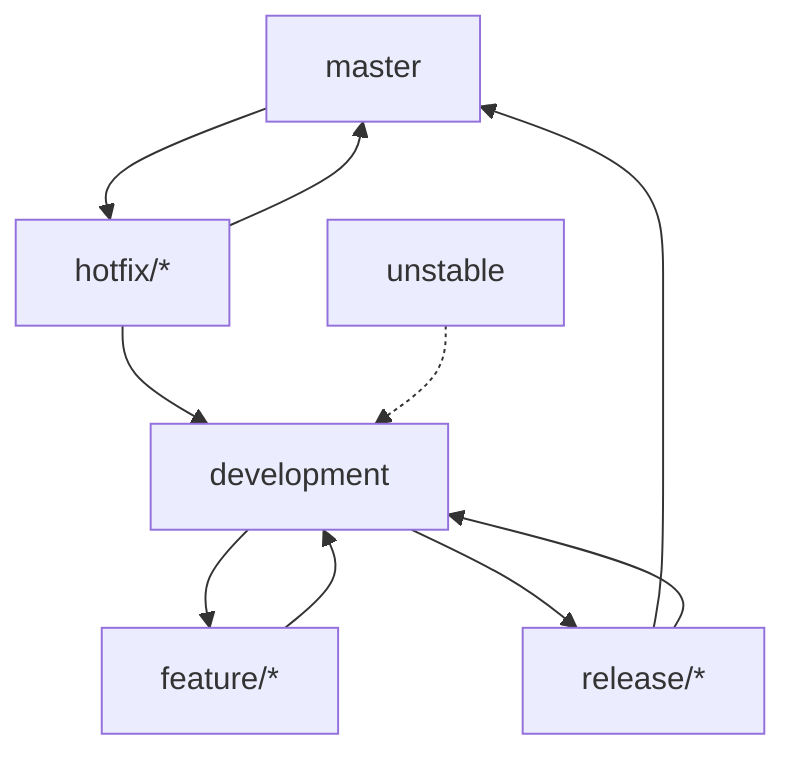

# Turnix Branching Strategy & Git Workflow

This document outlines the formal Git branching strategy and development workflow for the Turnix project. It is designed to support parallel development while maintaining the high stability required for operating system development.

## 1. Branch Structure

Turnix follows a hybrid model combining **Gitflow** for releases and **GitHub Flow** for feature development.

### Core Branches
- **`master`**: The production-ready state. Every commit to `master` must be tagged with a version and represent a stable milestone.
- **`development`**: The primary integration branch. All feature branches merge here first. This branch must always pass CI builds.
- **`unstable`**: Used for experimental or highly disruptive changes (e.g., architectural refactors) that are not yet ready for general integration.

### Supporting Branches
- **`feature/*`**: For new development.
  - *Convention*: `feature/JIRA-ID-description` or `feature/short-description`
  - *Example*: `feature/vfs-read-support`
- **`bugfix/*`**: For standard bug fixes.
  - *Convention*: `bugfix/description`
- **`hotfix/*`**: For critical production fixes targeting `master`.
  - *Convention*: `hotfix/v1.x.x-critical-fix`
- **`release/*`**: For version stabilization and preparation.
  - *Convention*: `release/vX.Y.Z`

---

## 2. Branch Lifecycle Flow



---

## 3. Workflow Guidelines

### Creating a Feature
1. Branch off from `development`.
2. Keep commits atomic and descriptive.
3. Follow the [Conventional Commits](https://www.conventionalcommits.org/) format (e.g., `feat:`, `fix:`, `docs:`, `chore:`).

### Merging Policy
- **Pull Requests (PRs)**: Required for all merges to `development` and `master`.
- **Code Review**: At least one approval is required from a core maintainer.
- **CI Status**: All status checks (build, smoke tests) must pass.
- **Squash and Merge**: Preferred for feature branches to keep `development` history clean.

### Conflict Resolution
1. **Rebase**: Always rebase your feature branch onto `development` before submitting a PR.
   ```bash
   git fetch origin
   git rebase origin/development
   ```
2. **Local Resolution**: Resolve conflicts locally, verify with `cargo xtask run-uefi`, then push with `--force-with-lease`.

---

## 4. Stability & Rollbacks

### Status Checks
- **CI Build**: UEFI loader and freestanding kernel must build successfully on Linux.
- **Smoke Test**: QEMU must boot to the shell and execute a heartbeat check.

### Rollback Strategy
- **`git revert`**: Preferred for single commits on shared branches to preserve history.
- **`git reset --hard`**: Only for local branches or recovery of the Trae workspace state.
- **Milestone Tags**: Always tag `master` before major merges.

---

## 5. Team Onboarding Template

When starting a new task:
1. `git checkout development`
2. `git pull origin development`
3. `git checkout -b feature/my-new-feature`
4. Implement and test locally with `cargo xtask doctor`.
5. Open a PR targeting `development`.
