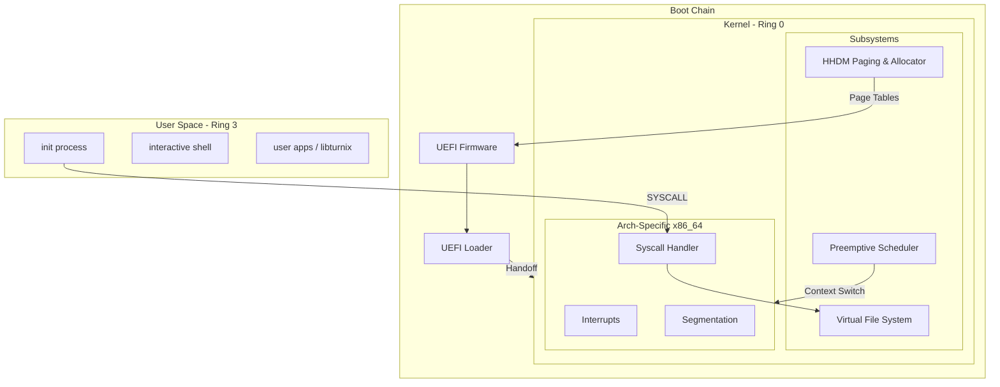

# turnix

**A SOTA, Rust-first operating system built for learning, performance, and long-term daily usability.**

`turnix` is a modern, x86_64 hobbyist operating system. It aims to combine the familiarity of Unix-like environments with a clean, type-safe internal design leveraging Rust's unique safety guarantees. It is not a Linux clone, but a new system designed from the ground up to be a viable environment for developers and power users.

## 🎯 Project Goals

- **Extreme Safety**: Leverage Rust to eliminate entire classes of memory and concurrency bugs.
- **Architectural Clarity**: Maintain a clean, documented codebase where every decision is recorded in [Architecture Decision Records (ADRs)](docs/decisions/).
- **Practicality**: Build toward a functional desktop environment with modern hardware support (Wayland, UEFI, NVMe).
- **Learning & Growth**: Serve as a high-quality educational resource for system-level programming.

## 🏗️ High-Level Architecture



## 🗺️ Roadmap Visuals

| Phase | Milestone | Features | Status |
|-------|-----------|----------|--------|
| **1** | **The Spark** | UEFI Boot, Serial Output, GDT/IDT | ✅ Done |
| **2** | **Memory** | Physical Allocator, Higher-Half Paging, Kernel Heap | ✅ Done |
| **3** | **Multitasking** | Tasks, Preemptive RR Scheduler, Context Switching | ✅ Done |
| **4** | **Ring 3** | User Mode, ELF Loader, Syscall ABI | ✅ Done |
| **5** | **Usability** | Keyboard Driver, VFS, Interactive Shell | 🛠️ Active |
| **6** | **Storage** | AHCI/NVMe Drivers, Ext2/FAT32 File Systems | 📅 Planned |
| **7** | **Graphics** | Framebuffer, Window Compositor (Wayland-like) | 📅 Planned |

## 🤝 Contributing

We welcome collaborators! Whether you are a seasoned OS developer or just starting with Rust, there are many ways to help.

1.  **Read the Docs**: Check out our [Architecture](docs/architecture.md) and [Debugging Guide](docs/debugging.md).
2.  **Pick an Issue**: Look for [Good First Issues](docs/good-first-issues.md).
3.  **Follow the Workflow**: We use a structured [Git Workflow](docs/git-workflow.md).
4.  **Join the Discussion**: Submit an ADR or open a feature request.

### Contribution Rules
- All code must be idiomatically safe (minimize `unsafe` blocks).
- Every major architectural change requires an ADR update.
- Respect the [Code of Conduct](CODE_OF_CONDUCT.md).

## 🚀 Getting Started

Quickly run `turnix` in QEMU:

```powershell
# Prerequisites: Rust nightly, QEMU
cargo xtask doctor
cargo xtask run-uefi
```

See [Quickstart](docs/quickstart.md) for more details.

---
**Principles**: *Build step-by-step. Document every decision. Safety first.*
