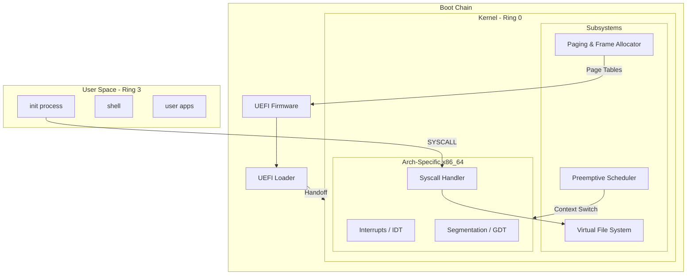

# turnix

**A Rust-first operating system built step by step for learning and long-term usability.**

turnix aims to feel familiar to Linux users while keeping a cleaner internal design. It is not a Linux clone and not a distro. It is a new operating system with Linux-like workability and a modern desktop roadmap.

## Architecture



## Current Status

| Phase | Status | Milestone |
|-------|--------|-----------|
| 0 | Complete | Foundation and scaffold |
| 1 | Complete | First boot and UEFI loader |
| 2 | Complete | Freestanding kernel handoff |
| 3 | Complete | Physical memory bring-up |
| 4 | Complete | Stable kernel scheduler baseline |
| 5 | Complete | User mode and ELF runtime |
| 6 | In progress | Terminal-first usability |
| 7 | Pending | Wayland desktop path |

## What Works

- **UEFI Loader**: Secure handoff to freestanding kernel with `BootInfo` ABI v3.
- **Memory Management**: Physical frame allocator, higher-half paging, and kernel heap.
- **Multitasking**: Preemptive scheduler with kernel threads and user processes.
- **User Mode**: Ring 3 transition, `SYSCALL` interface, and ELF loading.
- **VFS**: Initramfs-backed virtual file system.
- **Portability**: Verified on Linux (KVM/TCG) and Windows (WHPX).

## Verification & Proof

The system's stability is verified through automated boot tests in QEMU. 

**Successful Boot & User Mode Transition:**
```text
turnix UEFI loader
kernel loaded: entry=0xffffffff80000000
exiting boot services
Switching CR3...
Jumping to kernel...
[STG: KERNEL_REACHED]
[STG: PAGING_INIT]
[STG: HEAP_INIT]
[STG: ARCH_INIT]
[STG: VFS_INIT]
[STG: INIT_LOAD]
[STG: INIT_READY]
[STG: INTR_ENABLED]
[STG: SCHED_START]
Hello from User Mode init process (using libturnix)!
This demonstrates a stable SOTA syscall interface.
[syscall] exit code: 0
```

## Documentation

- [Design Decisions (ADRs)](docs/decisions/)
- [Debugging Guide](docs/debugging.md)
- [Architecture](docs/architecture.md)
- [Roadmap](docs/roadmap.md)
- [Phase 1-5 Milestone Details](docs/)
- [Windows Host Setup](docs/windows-host-setup.md)
## Repository Layout

```text
docs/          project documentation, ADRs, and guides
boot/          UEFI firmware-facing entry points
kernel/        freestanding kernel core
shared/abi     shared types for kernel or future userland boundaries
shared/serial  low-level serial output support
tools/xtask    developer automation
```

## Principles

- Learn deeply while building something real
- Prefer clean interfaces over milestone shortcuts
- Use open standards where compatibility matters
- Keep unsafe Rust small and justified
- Write docs as we go so the architecture stays replaceable
