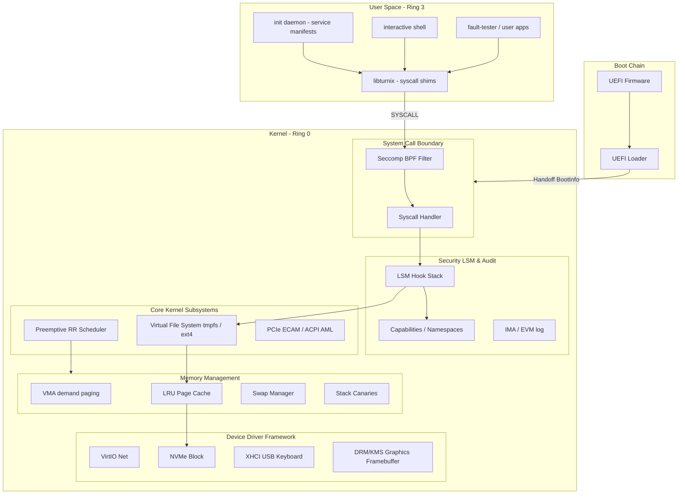

# Turnix


**A SOTA, Rust-first operating system built for learning, performance, and long-term daily usability.**

`turnix` is a modern, x86_64 hobbyist operating system designed from the ground up to combine the safety and type guarantees of Rust with a POSIX-compatible environment. It is not a Linux clone, but a state-of-the-art microkernel/modular monolith hybrid aiming to be a viable environment for developers and power users.

---

## 🎯 Key Subsystems & Accomplishments

Turnix features a highly mature kernel and userland stack:

*   **Virtual Memory Management (VMM)**: Support for Higher-Half Direct Mapping (HHDM) paging, dynamic kernel/user heap layout, thread stack isolation, strict **W^X (Write XOR Execute)** memory enforcement, demand paging, and `mmap`/`munmap` system calls.
*   **Security & Hardening**:
    *   **POSIX Capabilities**: Implements standard 64-bit capability sets (`permitted`, `effective`, `inheritable`, `bounding`, `ambient`) to enforce least-privilege.
    *   **Namespaces**: Process isolation using PID, Mount, Network, and User namespaces.
    *   **Seccomp-BPF**: System call restriction using custom classical BPF filters inherited across process boundaries.
    *   **Linux Security Modules (LSM)**: Pluggable LSM hooks (`file_open`, `process_create`, `ipc_send`, etc.) with a default Unix Discretionary Access Control (DAC) hook.
    *   **Integrity Measurement (IMA/EVM)**: SHA-256 binary measurements and extended attributes verification (EVM) for files.
    *   **Kernel Canaries**: Stack corruption detection at the base of task stacks.
    *   **ASLR & KASLR**: User-space load/stack base randomization and Kernel Address Space Layout Randomization (KASLR) at boot.
*   **POSIX System Services**:
    *   Full process table support (`ppid`, `ProcessState`, standard signals).
    *   `fork`, `exec`, and `wait`/`waitpid` process lifecycle management.
    *   Virtual File System (VFS) with mounts (`/` on `tmpfs` and `/mnt` on `ext4` read-write).
    *   Inter-Process Communication (IPC) via ring-buffered pipes (with full blocking support and `SIGPIPE` delivery) and bidirectional Unix domain sockets.
    *   File descriptor tables (up to 1024 open files) with standard `stdin`/`stdout`/`stderr` inheritance and `dup`/`dup2` redirection.
*   **Device Driver Framework**:
    *   **ACPI**: Superblock parsing (RSDP, XSDT, MCFG, DSDT/SSDT) and AML interpreter evaluation with S0/S5 power states.
    *   **PCI/PCIe**: MMIO walks via PCIe ECAM mapping.
    *   **VirtIO-Net**: Feature negotiation and MAC extraction for virtual networking.
    *   **NVMe**: Block device driver supporting submission/completion queues and PRP-based data transfers.
    *   **XHCI USB**: Controller initialization, USB 2.0/3.x enumeration, and USB Keyboard input handlers.
    *   **DRM/KMS Graphics**: bochs-display framebuffers mapping for composites/compositors.

---

## 🏗️ High-Level Architecture



---

## 🗺️ Milestone Roadmap

| Phase | Milestone | Features | Status |
| :--- | :--- | :--- | :--- |
| **Phase 1** | **Boot & Drivers** | UEFI Boot, ACPI Table Parser, PCIe ECAM, VirtIO-Net, NVMe, XHCI USB, GPU DRM/KMS | ✅ Complete |
| **Phase 2** | **Memory Subsystem** | VMAs, Demand Paging, mmap/munmap, LRU Page Cache, Swap, ASLR/KASLR, OOM Killer | ✅ Complete |
| **Phase 3** | **POSIX Services** | Process table, `fork`/`exec`/`waitpid`, VFS mounts (tmpfs/ext4), Pipes, Sockets, Signals, Stdio, Init manifest daemon | ✅ Complete |
| **Phase 4** | **Security Hardening** | POSIX Capabilities, Isolation Namespaces, Seccomp-BPF filters, LSM hooks, IMA/EVM, Stack Canaries | ✅ Complete |
| **Phase 5** | **Package Management** | Dependency Solver (SAT CDCL), manifest parsing, TUF repositories, package staging, rollback pipeline | ✅ Complete |
| **Phase 6** | **System Services** | IPC Broker daemon, structured log framework (HMAC-SHA256), service unit manager (socket activation) | ✅ Complete |
| **Phase 7** | **Desktop Environment** | Window Compositor (Wayland-like), input event routing, desktop session management | ✅ Complete |

> See [KNOWN_ISSUES.md](KNOWN_ISSUES.md) for known limitations and future work.

---

## 🚀 Getting Started

### 1. Prerequisites
You need the nightly Rust toolchain, QEMU, and EDK2 UEFI firmware images.
To verify your environment is ready, run:
```bash
cargo fmt --check
cargo xtask doctor
```

### 2. Configure OVMF Firmware Paths
On some distributions (e.g. Arch Linux), the UEFI firmware path varies. You can specify the paths manually in your shell environment:
```bash
export TURNIX_OVMF_CODE="/usr/share/edk2/x64/OVMF_CODE.4m.fd"
export TURNIX_OVMF_VARS="/usr/share/edk2/x64/OVMF_VARS.4m.fd"
```

### 3. Run QEMU Interactive Mode
Build the UEFI image and run the OS in QEMU:
```bash
cargo xtask run-uefi
```

### 4. Run Headless / Non-Interactive (useful for CI/tests)
To run the boot sequence in headless mode, specify:
```bash
TURNIX_QEMU_DISPLAY=none cargo xtask test-qemu
```

---

## 🧪 Testing & Verification Suite

Turnix contains a comprehensive test suite covering all layers of the kernel and userland:

*   **Host Workspace Tests**: Runs host unit tests on shared utilities, init configurations, and system ABI encoders:
    ```bash
    cargo test --all-targets
    ```
*   **Kernel Unit and Property Tests**: Runs target-specific memory management and security model verification tests:
    ```bash
    cargo test -p turnix-kernel
    ```
*   **Boot & Userland Smoke Tests**: Tests UEFI loaders, kernel initialization, VFS mounts, and userland execution in QEMU:
    ```bash
    TURNIX_QEMU_DISPLAY=none cargo xtask test-qemu
    ```

---

**Principles**: *Type safety first. Document every decision. Clean separation of mechanism and policy.*
