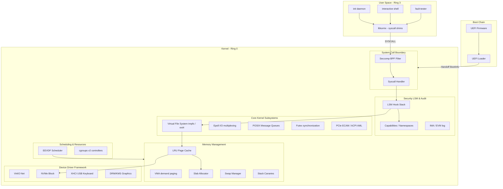

# Turnix


**A SOTA, Rust-first operating system built for learning, performance, and long-term daily usability.**

`Turnix` is a modern, x86_64 hobbyist operating system designed from the ground up to combine the safety and type guarantees of Rust with a POSIX-compatible environment. It is not a Linux clone, but a state-of-the-art microkernel/modular monolith hybrid aiming to be a viable environment for developers and power users.

---

## Key Subsystems

*   **Virtual Memory Management**: Higher-Half Direct Mapping (HHDM) paging, dynamic kernel/user heap layout, thread stack isolation, strict **W^X** memory enforcement, demand paging, `mmap`/`munmap`/`mmap2`/`mprotect` system calls, slab allocator for kernel object caching, and **KASAN** (Kernel Address Sanitizer) with shadow memory poisoning.
*   **Security & Hardening**: POSIX Capabilities, PID/Mount/Network/User namespaces, Seccomp-BPF filters, Linux Security Module (LSM) hooks with DAC, IMA/EVM integrity measurement, stack canaries, ASLR & KASLR.
*   **POSIX Services**: Full process table, `fork`/`exec`/`waitpid`, VFS mounts (tmpfs plus in-memory ext4 state), pipes, Unix domain sockets, POSIX message queues, POSIX shared memory, futex synchronization, epoll event-driven I/O multiplexing, `eventfd`/`timerfd`, file descriptor tables with `dup`/`dup2`, `lseek`, `open` with flags, and **io_uring** async I/O.
*   **Scheduling & Resource Management**: EEVDF (Earliest Eligible Virtual Deadline First) scheduler with 40 nice levels, scheduler classes (SCHED_NORMAL/BATCH/FIFO/RR/IDLE), cgroups v2 (CPU quota, memory limits, OOM-kill, PID limits), SMP with per-CPU scheduling.
*   **Concurrency Primitives**: SeqLock, RwLock, RCU (read-copy-update), work queues, softirq (8 vectors), completion variables, tasklets, lockdep, per-CPU counters.
*   **Device Drivers**: ACPI (RSDP/XSDT/MCFG/DSDT/SSDT + AML interpreter), PCI/PCIe ECAM, VirtIO-Net, NVMe, XHCI USB keyboard, DRM/KMS graphics.

---

## Architecture



---

## Roadmap

| Phase | Milestone | Features | Status |
| :--- | :--- | :--- | :--- |
| **1** | **Boot & Drivers** | UEFI Boot, ACPI, PCIe ECAM, VirtIO-Net, NVMe, XHCI USB, DRM/KMS | Done |
| **2** | **Memory Subsystem** | VMAs, Demand Paging, mmap/munmap, LRU Page Cache, Swap, ASLR/KASLR, OOM Killer | Done |
| **3** | **POSIX Services** | Process table, fork/exec/waitpid, VFS (tmpfs/ext4), Pipes, Sockets, Signals, Init daemon | Done |
| **4** | **Security Hardening** | Capabilities, Namespaces, Seccomp-BPF, LSM hooks, IMA/EVM, Stack Canaries | Done |
| **5** | **Package Management** | SAT CDCL dependency solver, TUF repositories, package staging, rollback | Done |
| **6** | **System Services** | IPC Broker, structured logging (HMAC-SHA256), service unit manager | Done |
| **7** | **Desktop Environment** | Window compositor, input routing, desktop session management | Done |
| **8** | **SMP & Scheduler** | EEVDF scheduler, scheduler classes, cgroups v2, SMP AP bring-up, slab allocator | Done |
| **10** | **Async I/O** | epoll, futex, POSIX message queues, POSIX shared memory, eventfd, timerfd | Done |
| **12** | **Scalability** | SeqLock, RwLock, RCU, work queues, softirq, completion, lockdep, per-CPU counters | Done |
| **13** | **Advanced I/O** | io_uring (3 syscalls, 12 ops), eventfd, timerfd, core async I/O | Partial |

See [docs/roadmap.md](docs/roadmap.md) for the full 22-phase roadmap. See [KNOWN_ISSUES.md](KNOWN_ISSUES.md) for known limitations.

---

## Getting Started

### Prerequisites

- Rust nightly-2026-06-22 toolchain
- QEMU (x86_64 with OVMF UEFI firmware)

```bash
cargo xtask doctor    # verify environment
```

### Configure OVMF Paths (if needed)

```bash
export TURNIX_OVMF_CODE="/usr/share/edk2/x64/OVMF_CODE.4m.fd"
export TURNIX_OVMF_VARS="/usr/share/edk2/x64/OVMF_VARS.4m.fd"
```

### Run in QEMU

```bash
cargo xtask run-uefi              # interactive
TURNIX_QEMU_DISPLAY=none cargo xtask test-qemu   # headless / CI
```

### Build

```bash
cargo xtask build-uefi            # UEFI loader
cargo xtask build-kernel          # freestanding kernel
```

---

## Testing

```bash
cargo test --workspace            # all host + kernel tests
cargo test -p turnix-kernel       # kernel-specific tests
cargo clippy -- -D warnings       # lint (zero warnings)
cargo fmt --check                 # format check
```

---

## Contributing

See [CONTRIBUTING.md](CONTRIBUTING.md) for setup, coding standards, and PR workflow.

---

## License

This project is licensed under the [Apache License 2.0](LICENSE).
