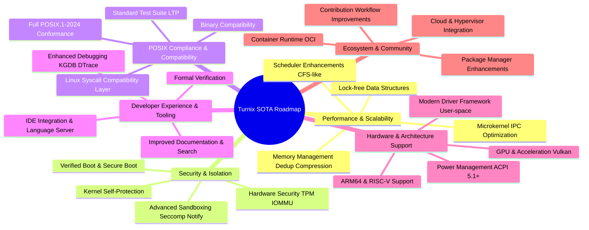

# SOTA Gap Analysis

Comprehensive state-of-the-art (SOTA) operating system assessment of Turnix OS
on the `development` branch (June 22, 2026). This is the authoritative reference
for what must be built to compete with Linux, FreeBSD, Redox, and Fuchsia.

---

## Mindmap

---

## Current State Assessment

Turnix is a **Rust-first, x86_64 microkernel/modular monolith hybrid** OS with
a strong emphasis on safety and modern design. Phases 1-7, 8, and 10 are complete.

| Area                    | Current State            | SOTA Level |
| ----------------------- | ------------------------ | ---------- |
| Boot & Drivers          | Excellent hobby-OS level | 8/10       |
| Memory Management       | Good + slab allocator    | 7/10       |
| POSIX Services          | Good + epoll/futex/mqueue| 8/10       |
| Security                | Very ambitious           | 8/10       |
| Scalability             | CFS scheduler + cgroups  | 6/10       |
| Multiprocessor Support  | Basic SMP (AP bring-up)  | 4/10       |
| Networking              | Basic                    | 3/10       |
| Storage                 | Basic                    | 4/10       |
| Performance Engineering | Minimal                  | 3/10       |
| Developer Ecosystem     | Good                     | 6/10       |
| Production Readiness    | Experimental             | 3/10       |

### Already Completed (Phases 1-7, 8, 10)

- **Boot & Drivers:** UEFI boot, ACPI, PCIe, VirtIO-Net, NVMe, XHCI USB, GPU DRM/KMS
- **Memory Subsystem:** VMAs, demand paging, mmap/munmap, LRU page cache, swap, ASLR/KASLR, slab allocator
- **POSIX Services:** Process table, fork/exec/waitpid, VFS mounts (tmpfs/ext4), pipes, sockets, signals, init daemon
- **IPC & Async I/O:** Epoll (I/O multiplexing), futex (userspace sync), POSIX message queues, POSIX shared memory
- **Scheduling:** CFS vruntime scheduler, scheduler classes (NORMAL/BATCH/FIFO/RR/IDLE), per-CPU scheduling
- **Resource Isolation:** cgroups v2 with CPU, memory, and PIDs controllers
- **SMP:** Application Processor bring-up via SIPI sequence
- **Security Hardening:** POSIX capabilities, namespaces, seccomp-BPF, LSM hooks, IMA/EVM, stack canaries
- **Package Management:** SAT-based dependency solver, TUF repositories, rollback pipeline
- **System Services:** IPC broker, structured logging, service unit manager
- **Desktop Environment:** Wayland-like compositor, input routing, session management

### Key Strengths

- **Memory Safety:** Rust eliminates entire classes of memory safety vulnerabilities
- **Modular Design:** Hybrid kernel allows flexibility and maintainability
- **Modern Security Model:** Capabilities, namespaces, seccomp are state-of-the-art
- **Comprehensive Documentation:** Detailed docs, roadmap, known issues tracking

---

## Gap Details

### 1. Performance & Scalability

#### 1a. Microkernel IPC Optimization

**Current:** Pipes (ring-buffered, slab-allocated), Unix domain sockets, POSIX message queues, POSIX shared memory, epoll (I/O multiplexing), futex (userspace sync).

**SOTA Requirements:**

- ~~Asynchronous message passing for non-blocking IPC~~ (POSIX mqueues with blocking)
- ~~Shared memory channels for bulk data transfer~~ (ShmOpen/ShmUnlink via /dev/shm/)
- ~~POSIX message queues for structured message passing~~ (MqOpen/MqSend/MqReceive)
- Copy-on-write optimizations for large payloads
- ~~futexes (fast userspace mutexes) for synchronization~~ (FUTEX_WAIT/FUTEX_WAKE)
- ~~epoll (event notification) for I/O multiplexing~~ (EpollCreate/EpollCtl/EpollWait)
- io_uring-like async I/O interface
- Benchmark against Linux `mmap` and `pipe` performance

**Priority:** Critical

#### 1b. Scheduler Enhancements

**Current:** CFS vruntime scheduler with scheduler classes (NORMAL/BATCH/FIFO/RR/IDLE), cgroups v2 integration.

**SOTA Requirements:**

- ~~CFS-like scheduler: Virtual runtime tracking, red-black tree of runnable tasks~~ (vruntime per task, lowest-first selection)
- **EEVDF (Earliest Eligible Virtual Deadline First):** Better fairness and responsiveness
- ~~Scheduler classes: RealTime (FIFO/RR), Fair (CFS), Idle, Batch~~ (SchedulingPolicy enum)
- Priority inheritance for priority inversion avoidance
- CPU affinity and scheduler domains
- ~~cgroups v2 integration for resource control~~ (CPU/memory/PIDs controllers)

**Priority:** Critical

#### 1c. Memory Management Optimizations

**Current:** Demand paging, mmap, page cache, swap, ASLR/KASLR, slab allocator.

**SOTA Requirements:**

- **Memory Deduplication (KSM):** Same-page merging across processes/containers
- **Swap Compression (zswap/zram):** Compress pages before disk write
- **Transparent Huge Pages (THP):** 2MB/1GB pages to reduce TLB misses
- ~~**Slab/SLUB allocator:** Object caching for frequent allocations~~ (slab_alloc/slab_dealloc with SlabCache)
- **Per-CPU caches:** Reduce lock contention on allocator

**Priority:** High

#### 1d. Lock-free Data Structures

**Current:** Spinlocks and mutexes in hot paths.

**SOTA Requirements:**

- Lock-free VFS path lookup
- Wait-free scheduler run queue operations
- Atomic counters for shared statistics
- RCU (Read-Copy-Update) for read-heavy data structures

**Priority:** High

---

### 2. Security & Isolation

#### 2a. Verified Boot & Secure Boot

**Current:** TPM 2.0 TIS driver (seal/unseal).

**SOTA Requirements:**

- Full verified boot chain: UEFI Secure Boot → signed loader → verified kernel
- TPM PCR extension for measuring all boot components
- dm-verity for root filesystem integrity
- Secure boot policy enforcement

**Priority:** High

#### 2b. Kernel Self-Protection

**Current:** KASLR, stack canaries, W^X.

**SOTA Requirements:**

- **Control Flow Integrity (CFI):** Prevent ROP/JOP attacks on indirect calls
- **KPTI (Kernel Page Table Isolation):** Mitigate Meltdown-class attacks
- **Hardened Usercopy:** Bounds checking on all copy_to/from_user
- **Guard Pages:** PROT_NONE between kernel stacks, heap, mmap regions
- **Init-on-Alloc/Free:** Zero memory on allocation, zero on free
- **Kernel Lockdown:** Restrict /dev/mem, ACPI access post-boot
- **Stack Clashing Prevention:** Randomized, properly sized guard pages

**Priority:** High

#### 2c. Advanced Sandboxing

**Current:** Seccomp-BPF with basic actions.

**SOTA Requirements:**

- **Seccomp Notify:** User-space notification for dynamic policy decisions
- **Landlock LSM:** Unprivileged sandboxing via BPF-like policy
- **Capability Bounding:** Permanent capability dropping via prctl
- **Container runtime integration:** Bubblewrap/Flatpak-style sandboxing

**Priority:** High

#### 2d. Hardware Security Features

**Current:** TPM 2.0 basic integration.

**SOTA Requirements:**

- **IOMMU Support:** DMA protection and device isolation for user-space drivers
- **Memory Tagging:** ARM MTE or equivalent for runtime memory safety
- **Intel CET / AMD Shadow Stacks:** Hardware-backed control flow protection
- **Kernel Crypto API:** AES-GCM, ChaCha20-Poly1305, SHA-256/SHA-3

**Priority:** Medium

---

### 3. POSIX Compliance & Compatibility

#### 3a. Full POSIX.1-2024 Conformance

**Current:** Basic POSIX services (fork, exec, signals, pipes, sockets).

**SOTA Requirements:**

- Systematic testing against **Open POSIX Test Suite**
- Integration of **Linux Test Project (LTP)** into CI
- Full POSIX.1-2024 conformance certification
- Address all test failures

**Priority:** Critical — this is the gateway to porting real-world software

#### 3b. Linux Syscall Compatibility Layer

**Current:** No Linux binary compatibility.

**SOTA Requirements:**

- **Linux syscall translation layer** (similar to WSLg or LxRun)
- Translate Linux syscalls to Turnix native API
- Handle path and behavior differences
- Allow running unmodified Linux binaries

**Priority:** Critical — single highest-impact feature for adoption

#### 3c. Binary Compatibility

**Current:** No binary compatibility layers.

**SOTA Requirements:**

- BSD compatibility layer for Unix software
- Optional Windows compatibility layer (Wine-style)
- Standard C library compliance (musl or glibc port)

**Priority:** Medium

---

### 4. Developer Experience & Tooling

#### 4a. Enhanced Debugging Tools

**Current:** dmesg, basic serial logging.

**SOTA Requirements:**

- **KGDB:** Kernel debugging over serial/network
- **DTrace-like Tracing:** Dynamic tracing for kernel and user-space
- **Core Dump Improvements:** Compressed dumps with full thread state
- **Crash Dump Pipeline:** panic → coredump → post-mortem analysis

**Priority:** High

#### 4b. Formal Verification

**Current:** No formal verification.

**SOTA Requirements:**

- Explore **Verus** or **seL4's** framework for critical components
- Target: VMM, scheduler, IPC paths
- Mathematical proof of correctness for security-critical properties

**Priority:** Low (long-term research)

#### 4c. IDE Integration & Language Server

**Current:** No IDE integration.

**SOTA Requirements:**

- **LSP implementation** for Turnix system programming
- Autocompletion, go-to-definition for kernel APIs
- Inline documentation for syscalls and kernel structures

**Priority:** Medium

#### 4d. Documentation Improvements

**Current:** mdBook setup with chapters.

**SOTA Requirements:**

- Searchable documentation (mdbook search)
- Architecture Decision Records (ADRs) consolidated
- Interactive tutorials for OS development
- API reference with examples

**Priority:** Medium

---

### 5. Hardware & Architecture Support

#### 5a. Multi-Architecture Support

**Current:** x86_64 only.

**SOTA Requirements:**

- **ARM64 (AArch64):** Full port with device tree, GIC, PE
- **RISC-V:** Full port with PLIC, SBI
- Architecture abstraction layer for portable code

**Priority:** High — essential for servers and embedded

#### 5b. Modern Driver Framework

**Current:** In-kernel standalone drivers.

**SOTA Requirements:**

- **User-space drivers:** GPU, network in user space for stability
- **Driver API Stability:** Freeze stable ABI for out-of-tree drivers
- **Driver model:** Bus, Device, Driver, Probe, Remove, Suspend, Resume

**Priority:** High

#### 5c. GPU & Acceleration

**Current:** DRM/KMS framebuffer, basic Wayland compositor.

**SOTA Requirements:**

- **Vulkan 1.0:** WSI for Wayland, command buffer submission
- **GPU Memory Management:** GEM/TTM buffer objects, GPU page tables
- **Hardware Compositing:** DRM atomic modesetting, overlay planes

**Priority:** Medium

#### 5d. Power Management

**Current:** Basic ACPI.

**SOTA Requirements:**

- **ACPI 5.1+:** Full table parsing, AML interpreter expansion
- **S-states:** Sleep, hibernate, shutdown
- **C-states:** CPU idle power management
- **P-states:** Dynamic frequency scaling
- **Runtime PM:** Device autosuspend

**Priority:** Medium — essential for laptops

---

### 6. Ecosystem & Community

#### 6a. Package Manager Enhancements

**Current:** SAT-based solver, TUF repos, rollback.

**SOTA Requirements:**

- **Binary repositories:** Pre-compiled packages for common software
- **Source-based packages:** Build from source with patch management
- **Repository mirroring:** Community mirrors for availability
- **Reproducible builds:** Deterministic compilation, buildID verification

**Priority:** High

#### 6b. Container Runtime

**Current:** Namespaces (PID, mount, network, user), cgroups v2 (CPU, memory, PIDs).

**SOTA Requirements:**

- **OCI-compatible container runtime**
- ~~cgroups v2 for resource limiting~~ (CPU/memory/PIDs controllers implemented)
- Container networking: veth pairs, bridge, overlay
- `turnix run alpine` experience

**Priority:** High

#### 6c. Cloud & Hypervisor Integration

**Current:** Runs on QEMU.

**SOTA Requirements:**

- **Guest OS optimization:** Run well on KVM, VMware, Hyper-V
- **Paravirt drivers:** VirtIO for performance
- **Cloud-init support:** Automated provisioning
- **Live migration:** Kernel state save/restore

**Priority:** Medium

#### 6d. Contribution Workflow

**Current:** Gitflow with master/development.

**SOTA Requirements:**

- Clear issue templates from KNOWN_ISSUES.md
- Good-first-issue labels for newcomers
- Regular release cadence with deprecation policies
- CI/CD pipeline with automated testing

**Priority:** Low

#### 6e. Distributed System Features

**Current:** No coverage.

**SOTA Requirements:**

- **Service discovery:** Dynamic service registration and lookup
- **Distributed filesystems:** Network-transparent file access
- **Cluster scheduler:** Multi-node workload distribution
- **Remote execution:** Execute tasks across network nodes

**Priority:** Low (future-looking)

---

## Roadmap Mapping

| Phase | Focus | Gaps Addressed | Priority |
|---|---|---|---|
| 8 | SMP & Scalable Scheduler | 1b, 1c partial, 6b partial | Critical |
| 9 | Networking Depth | (existing) | Critical |
| 10 | Async I/O & Process Isolation | 1a, 6b partial | High |
| 11 | Memory & Storage | 1c, filesystem gaps | High |
| 12 | Security Hardening | 2a, 2b, 2c, 2d | High |
| 13 | Performance & Observability | 4a, benchmarks | High |
| 14 | Graphics & Desktop | 5c | Medium |
| 15 | Self-Hosting & Ecosystem | 6a, POSIX compliance | High |
| 16 | Virtualization & Reliability | 6b, 6c | Medium |
| 17 | Distributed Systems | 6e | Low |

---

## Priority Summary

The five highest-impact areas for the next development cycle:

1. **POSIX Compliance + Linux Compat Layer** — gateway to real software
2. ~~**SMP + CFS/EEVDF Scheduler** — foundational for all parallelism~~ ✅ Done
3. **Verified Boot + Kernel Hardening** — security is non-optional
4. **IPC Optimization** — io_uring, CoW optimizations
5. **ARM64/RISC-V Support** — essential for relevance beyond x86

---

## Key Insights

- **Roadmap as living document:** Continuously update based on real-world usage
- **Security as foundation:** Layered, comprehensive hardening is standard for SOTA
- **Microkernel performance:** Aggressively optimize IPC to dispel hybrid design myths
- **Testing is non-negotiable:** Claiming POSIX compliance is insufficient; prove it with LTP
- **Binary compat is king:** Linux syscall layer is the single highest-impact adoption feature
